A C++ implementation of PixMix inpainting.

[Jan Herling and Wolfgang Broll, "High-Quality Real-Time Video Inpaintingwith PixMix," Vol. 20, Issue 6, pp. 866 - 879, 2014.](http://ieeexplore.ieee.org/document/6714519/)

# Features
* Inpainting only
	* No object selection and tracking
	* Only the basic spatial and appearance cost minimization (i.e., eq. 2 to 6)
* Portable and compatible implementation
	* The code requires a C++ complier and [OpenCV (2.X or heigher)](https://opencv.org/) only
* A collaborative work of [Shohei Mori](http://hvrl.ics.keio.ac.jp/mori/) and [Mariko Isogawa](https://sites.google.com/site/marikoisogawa/home/eng).
* Lisence
	* Lisence free but limited to **research purpose only**
	* Note that the code is **NOT** the original implementation (i.e., results may be different from the ones in the original paper)
	* We, therefore, assume no responsibility if a problem occurs
	* BUT we are pleased to have any kinds of feedback from you!!

# Usage
* Inputs
	* MAGENTA_MASK_MODE
		* 3ch color image with magenta color mask
	* The other
		* 3ch color image
		* 1ch black and white mask image
* Output
	* 3ch inpainted image

# Example Results

|color|mask|result|
|:-|:-|:-|
|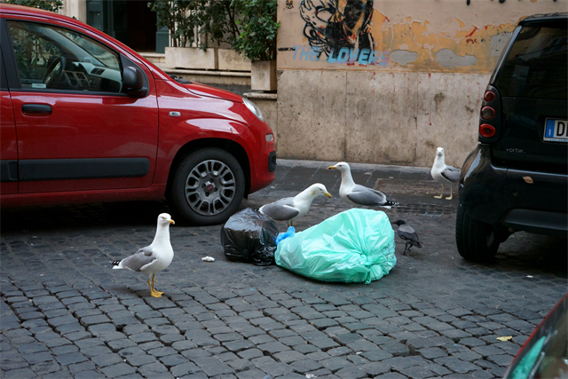|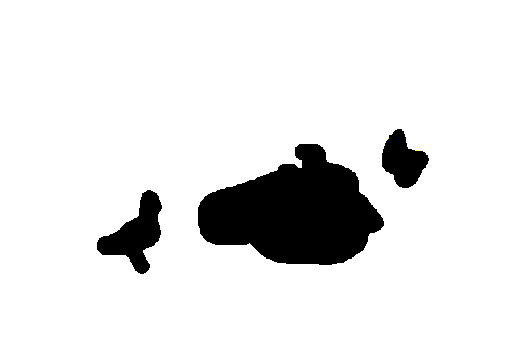|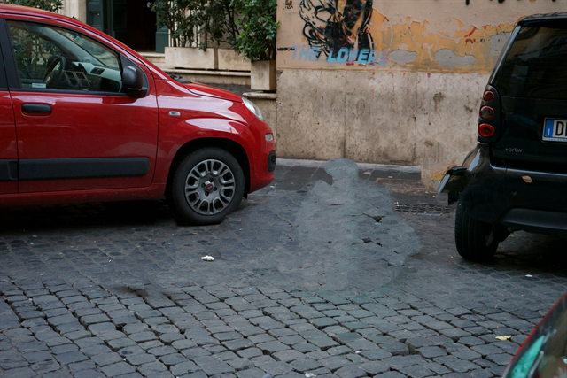
|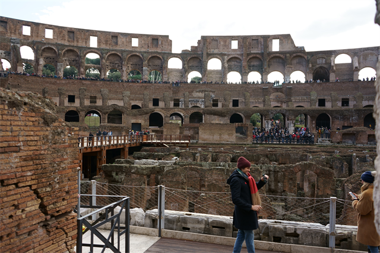|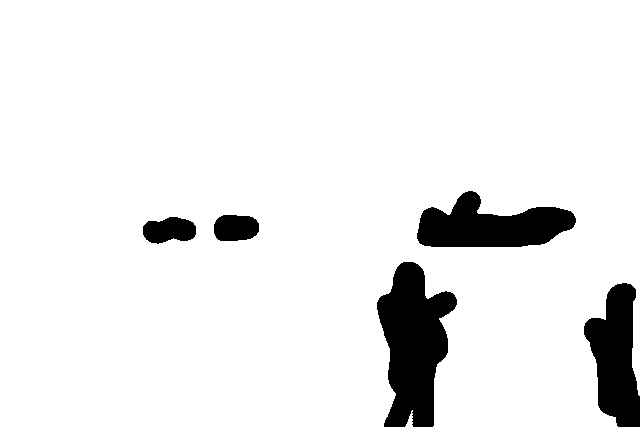|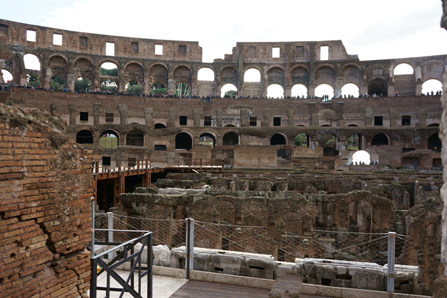
|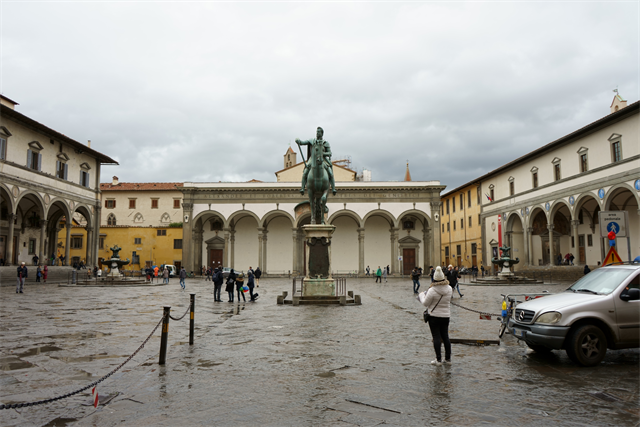|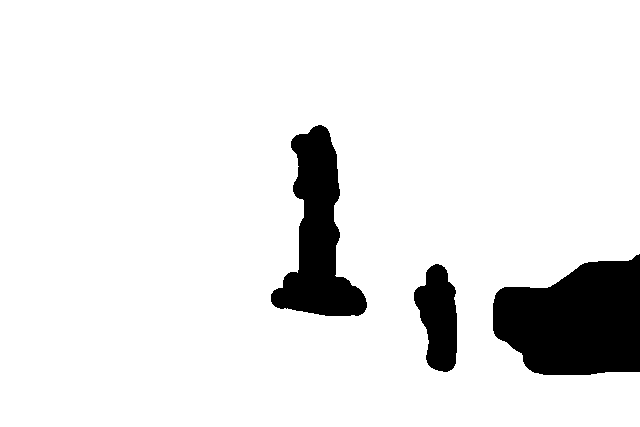|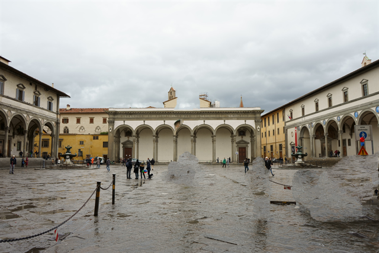
|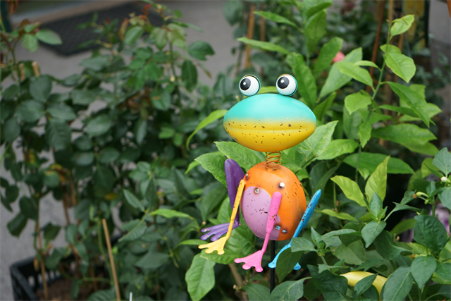||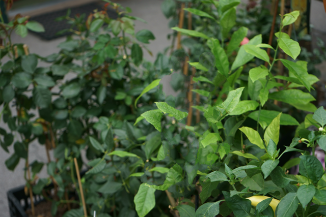
|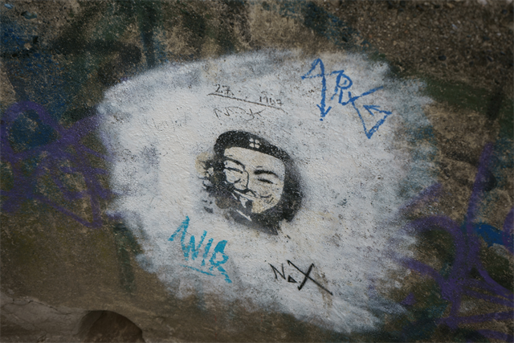|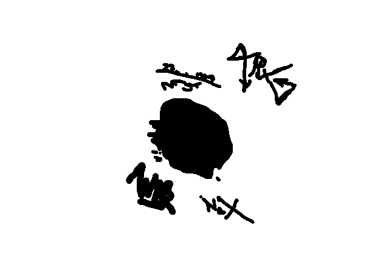|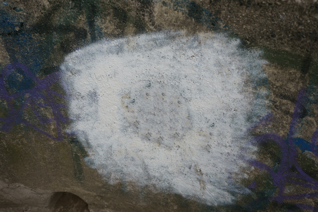
|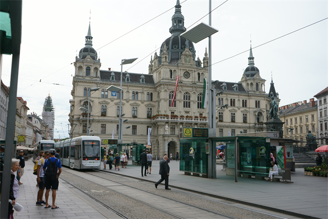|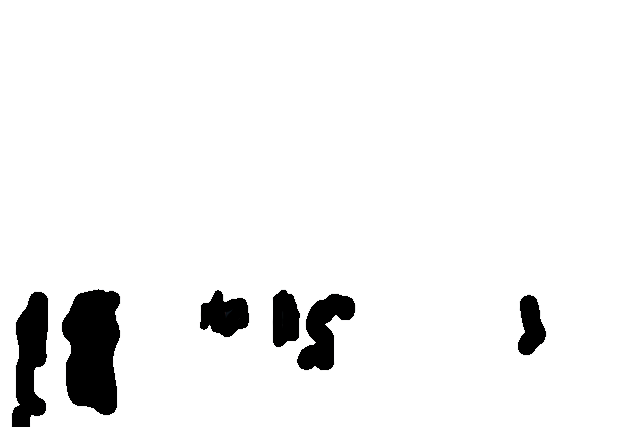|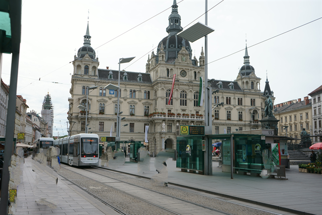
|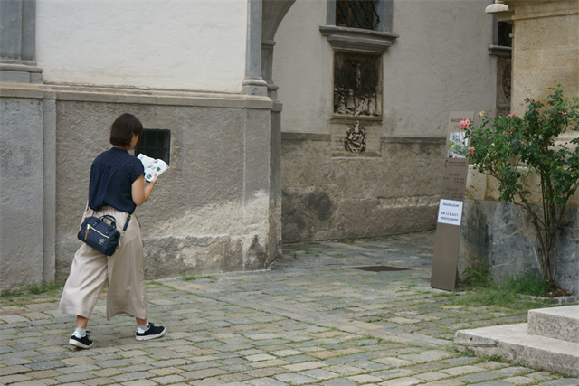||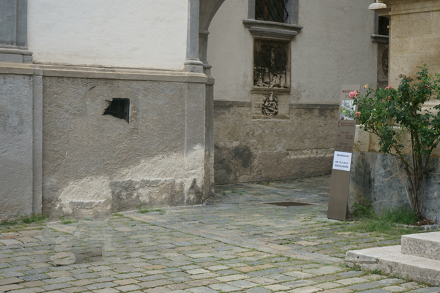
|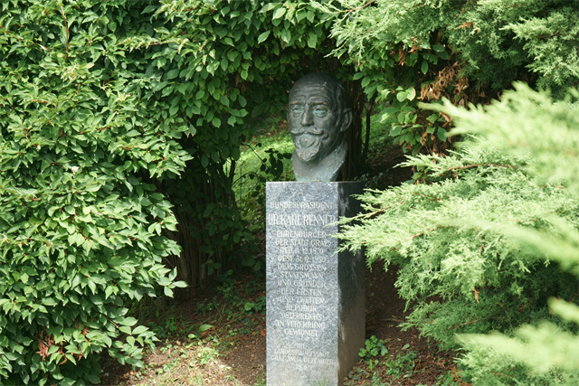|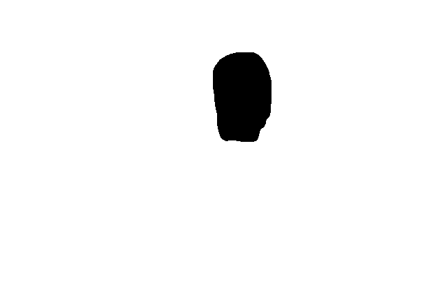|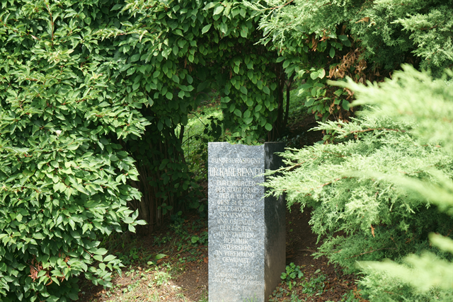
|||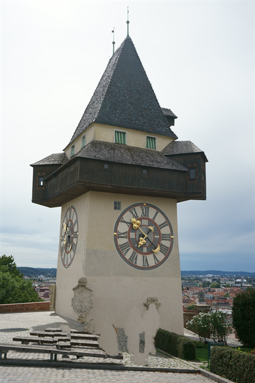
|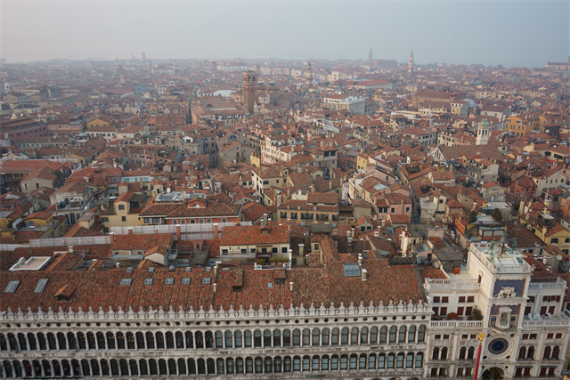||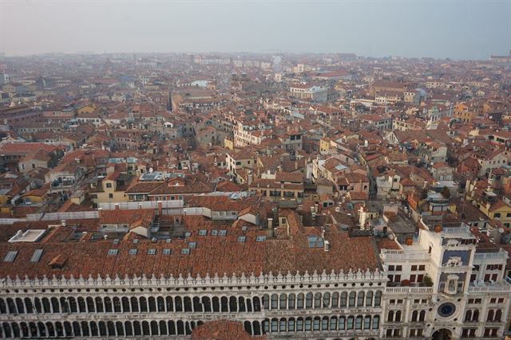
|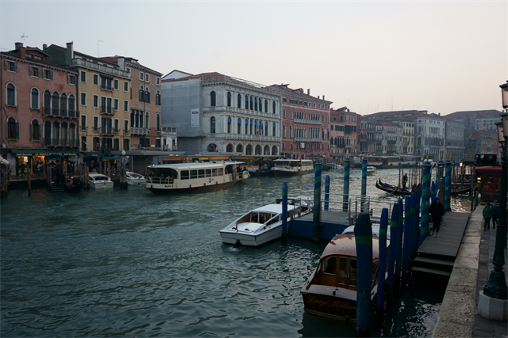|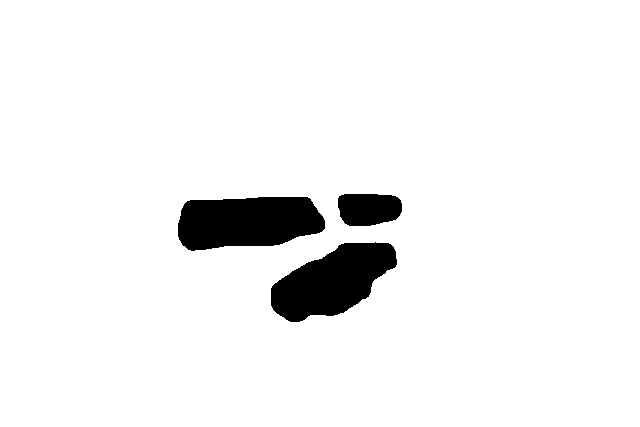|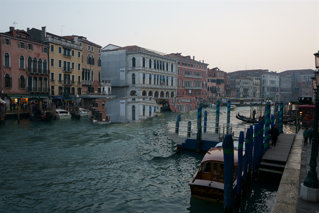
|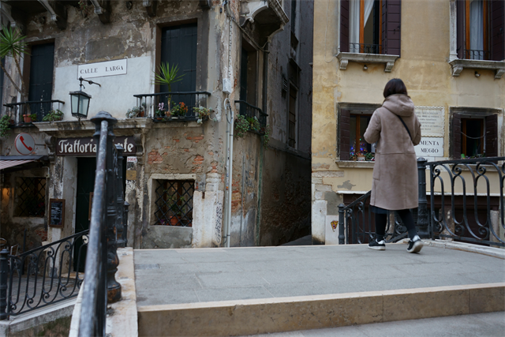||

# Tested Environment List
* Win 10 64bit + VS2015 + OpenCV 3.3.1
* maxOS 10.13.3 + OpenCV3.3.1